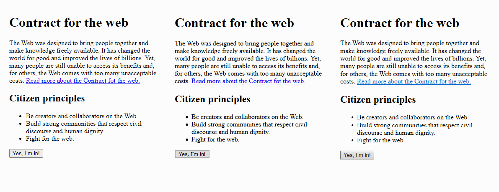

La idea de este artículo es hablar sobre las **etiquetas semánticas de HTML,** pero para entender y valorar este superpoder vamos a empezar haciendo un repaso por la historia del lenguaje y lo que conocemos, o creemos conocer, al respecto. __¿Tanto se puede hablar sobre HTML?__ Si, tanto y mucho más.

**HiperText Markup Language** es una de las tecnologías fundamentales de la web, su función es **definir la estructura y el significado del contenido web.**

## Un poco de historia
Hacia finales de los 80, millones de computadoras ya estaban conectadas a través de la creciente red Internet. La comunidad científica rápidamente adoptó esta herramienta como un medio para compartir información, pero enfrentando algunos desafíos en sus comienzos. Por aquellos días, dicha información se almacenaba individualmente en cada computadora, por lo que muchas veces obtener un documento implicaba conectarse a varios equipos distintos y hasta incluso aprender cómo funcionaba el o los programas en cada caso.

En 1989, el señor **Tim Berners-Lee** presentó mediante un documento llamado **“Information Managment: A Proposal”** su idea de compartir información en Internet explorando la tecnología del hipertexto. Para octubre de 1990, ya había desarrollado las tres tecnologías fundamentales de la web: **HTML** como lenguaje para dar formato a esos hipertextos, la tecnología **URI** para identificar estos recursos en la web __(lo que comúnmente conocemos como URL)__ y el protocolo de transferencia **HTTP** (Vaya curriculum, Tim!).

[En este enlace se puede leer mucho más sobre la fascinante historia de la web!](https://webfoundation.org/about/vision/history-of-the-web/)

## A simple vista
Sabemos que HTML no es un lenguaje de programación, pero entonces qué es? **HTML** es un lenguaje de marcado, que nos permite **definir** el contenido web. Repasemos cómo funciona un lenguaje de marcado a simple vista, si tenemos el siguiente contenido:

```
Título: 
“Contract for the web”

Párrafo de texto: 
“The Web was designed to bring people together and make knowledge freely available. It has changed the world for good and improved the lives of billions. Yet, many people are still unable to access its benefits and, for others, the Web comes with too many unacceptable costs. Read more about the Contract fot the web. (Link to https://contractfortheweb.org).”

Subtítulo: 
“Citizen principles”

Ítems: 
- Be creators and collaborators on the Web.
- Build strong communities that respect civil discourse and human dignity.
- Fight for the web.
- Botón: “Yes, I’m in!”
```

En nuestro documento HTML, cada parte del contenido será delimitada con etiquetas, de la siguiente manera:

```html
<h1>Contract for the web</h1>


<p>The Web was designed to bring people together and make knowledge freely available. It has changed the world for good and improved the lives of billions. Yet, many people are still unable to access its benefits and, for others, the Web comes with too many unacceptable costs. <a href="https://contractfortheweb.org/">Read more about the Contract fot the web.</a></p>

<h2>Citizen principles</h2>

<ul>
  <li>Be creators and collaborators on the Web.</li>
  <li>Build strong communities that respect civil discourse and human dignity.</li>
  <li>Fight for the web.</li>
</ul>

<button>Yes, I’m in!</button>
```

Todo bastante simple por el momento, podemos ver que cada etiqueta tiene una apertura `<etiqueta>` y un cierre `</etiqueta>` y que existen distintas etiquetas para los distintos elementos que necesitamos mostrar.

Ahora bien, veamos qué resultado tiene esto en el navegador. En la siguiente imagen encontramos las vistas en Chrome, Firefox y Edge.



<p id="browser-preview-description">A grandes rasgos, tenemos los mismos resultados: títulos con un font size mayor (a mayor jerarquía, mayor tamaño) y estilo bold. El enlace es de color azul y está subrayado. En el listado se utilizan íconos circulares y espaciado para indicar cada ítem. El botón tiene forma rectangular, borde y color de fondo. Podemos pensar __"Así es como se ve el HTML"__ y ese es nuestro primer error: asociar su función con eso que vemos en el navegador, considerar a HTML como una herramienta básica para mostrar contenido en la web.</a>

Pero si comparamos más en detalle las capturas de los distintos navegadores, vamos a encontrar algunas pequeñas diferencias. El tono de azul no es el mismo en los 3 enlaces. El ícono de los ítems no es del mismo tamaño en todos los casos. En el botón es donde más diferencias encontramos, incluso la forma es distinta. Entonces.. ¿Qué está pasando? ¿el HTML se ve distinto en diferentes navegadores?

En realidad no, lo que estamos viendo no es parte del HTML. Es el resultado de los estilos CSS que cada navegador asigna por defecto a las distintas etiquetas HTML. Podemos comprobarlo aplicando un Reset CSS, sin esos estilos nuestro documento HTML es sólo texto plano.

## Semántica HTML
Las etiquetas HTML son completamente invisibles en el navegador, ya que su función no tiene nada que ver con la forma en que se muestra visualmente el contenido. ¿Cuál es la función del código HTML entonces? Mucho más que imprimir texto plano en el navegador!

Volviendo a la definición inicial, la función del HTML es **definir la estructura y el significado del contenido web.** Y a eso nos referimos cuando hablamos de semántica: Transmitir, desde el código, información sobre la estructura y el significado del contenido web. Vamos a descubrir su importancia, conociendo a quién va dirigida esa información.

Por medio de la semántica, nuestro código HTML puede dialogar con las tecnologías de asistencia, para brindarles información adicional sobre el contenido que están explorando y hacerlo más accesible. De esta manera por ejemplo, un lector de pantalla puede indicarle al usuario que el texto que está leyendo es el título principal de esa sección, sin la necesidad de referencias visuales como la posición o el tamaño de la tipografía.

Dentro de estas tecnologías, existen herramientas más avanzadas que permiten incluso hacer un resumen del contenido analizando sus secciones, navegar a través de los títulos y subtítulos de un documento utilizándolos para configurar un índice, listar y analizar todos los enlaces disponibles, entre muchas otras cosas. Para que eso sea posible, la tecnología necesita entender de que se trata todo ese texto plano, cuál es su razón de ser, qué función cumple. Y para eso existen las etiquetas semánticas, su objetivo es contribuir a que el contenido web sea igualmente accesible para todos los usuarios.

## HTML5 y más allá.

La versión 5 de este lenguaje vio la luz por primera vez allá por 2014 e incorporó un gran número de etiquetas semánticas estructurales, multimedia y de texto. [Este link incluye un listado detallado de toda las etiquetas semánticas disponibles y sus características.](https://developer.mozilla.org/en-US/docs/Web/HTML/Element)

A nivel técnico escribir código HTML semántico no presenta grandes desafíos. Lo realmente importante es conocer el potencial de esta tecnología y entender que su influencia va más allá de lo que podemos ver en el navegador.